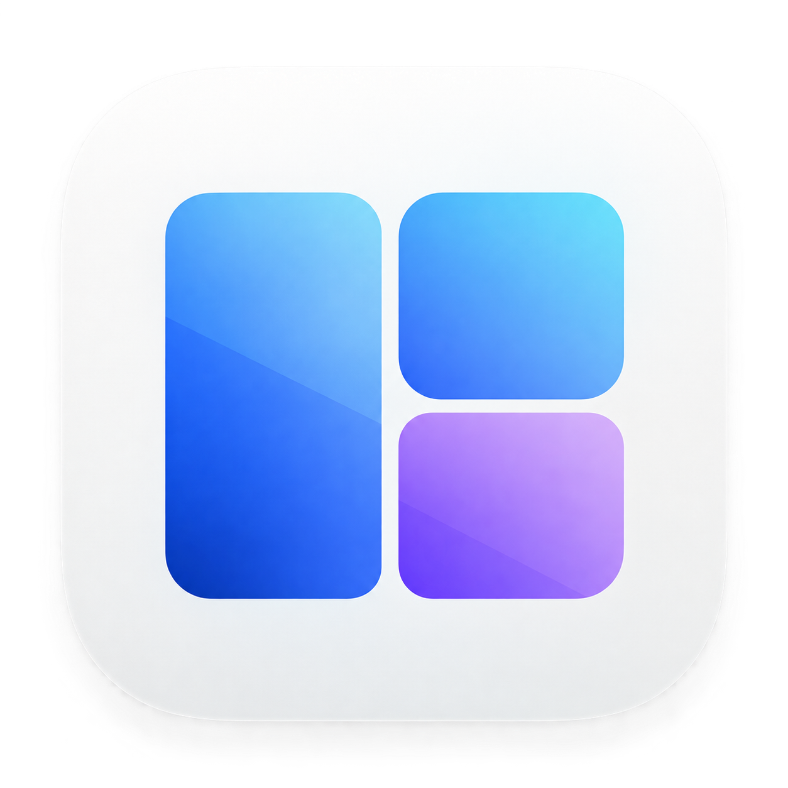

<p align="center">
  <a href="https://jgoneit.github.io/tessera/?lang=en">
    
  </a>
</p>

<h1 align="center">Tessera</h1>

<p align="center"><strong>Multiple grids. One set of arrow shortcuts.</strong><br />A menu bar window manager for macOS</p>

<p align="center">
  <a href="https://github.com/jgoneit/tessera/releases"></a>
  <a href="docs/INSTALL.en.md"></a>
  <a href="https://github.com/jgoneit/tessera/releases/tag/v0.1.0-alpha.3"></a>
</p>

<p align="center">
  <a href="https://github.com/jgoneit/tessera/releases/download/v0.1.0-alpha.3/Tessera-0.1.0-arm64.dmg"><strong>Download alpha.3 DMG</strong></a> ·
  <a href="https://jgoneit.github.io/tessera/?lang=en#demo"><strong>Try it in your browser</strong></a> ·
  <a href="docs/INSTALL.en.md">Installation guide</a>
</p>

<p align="center"><a href="README.md">한국어</a> · <strong>English</strong></p>

---

Choose your favorite grids from 2×2, 3×2, and 4×2, then move the current window with **Control + Option + arrow keys**.
Use the same shortcuts across grids and stop at the position and size that feels right.

- **Combine your grids.** Move left and right through the selected grids as your window changes width to match.
- **Change height one step at a time.** Move between top, full column, and bottom, or maximize with **Control + Option + Return**.
- **Make it yours.** Choose window spacing, Korean or English, and system, light, or dark appearance.

[Try the web demo](https://jgoneit.github.io/tessera/?lang=en#demo): choose a grid, then use your arrow keys and Return.

## How to use

1. On first launch, choose **Open Settings** in Tessera Settings.
2. Allow Tessera in **System Settings → Privacy & Security → Accessibility**.
   If it is missing from the list, use `+` to add the installed `/Applications/Tessera.app`.
   For development, use the actual path to `dist/Tessera.app`.
3. Return to Tessera Settings and use the refresh icon (**Check Again**) to check permission.
4. Under **Layouts**, select one or more of 2×2, 3×2, and 4×2. Only 3×2 is selected initially.
5. Activate a regular window in another app, then use a direction shortcut.

| Default shortcut | Action |
| --- | --- |
| Control+Option+← | Move to the previous candidate column across the selected grids, keeping the current height |
| Control+Option+→ | Move to the next candidate column across the selected grids, keeping the current height |
| Control+Option+↑ | Bottom cell → full column → top cell |
| Control+Option+↓ | Top cell → full column → bottom cell |
| Control+Option+Return | Maximize across the usable display without gaps |

Global shortcuts place the window immediately without opening the picker. Keyboard focus stays in the original app.
Success and correctly aligned app-size adjustments appear for about one second; position mismatches,
windows extending beyond the usable display area, and errors appear for about four seconds.
Unmodified arrow keys remain available to the original app.

Left and right move through the centers of every column in the selected grids, ordered from left to right,
and wrap around at either end. For example, selecting 2×2 and 3×2 gives this order:
`3×2 column 1 → 2×2 column 1 → 3×2 column 2 → 2×2 column 2 → 3×2 column 3`.
When navigation changes the grid, the window width changes to match it while retaining the top, full-column,
or bottom height state. Up and down stay in the current grid and column.
Tessera handles key repeat for left and right only, stopping when the key or a required modifier is released.
Up and down advance one step per press: release and press again to reach the next state.
They stop at the top and bottom states.
With only 3×2 selected, starting at the middle column `(2·5)` and pressing
`⌃⌥↑ → ⌃⌥→ → ⌃⌥→ → ⌃⌥↓` places the window at `2 → 3 → 1 → (1·4)`.
A full column fills the gap between its two zones as one window while preserving the outer gaps.

## Maximize and screen halves

Use **Control+Option+Return** or **Maximize** in the menu or picker to fill the usable display, excluding the menu bar
and Dock. Running it again keeps the window maximized. This does not enter macOS's separate full-screen Space.
Only maximization ignores Gap; the top and bottom screen halves retain the configured gap and pixel alignment.

| Current state | Control+Option+↑ | Control+Option+↓ |
| --- | --- | --- |
| Maximized | Top half of screen | Bottom half of screen |
| Top half of screen | Stay | Maximize |
| Bottom half of screen | Maximize | Stay |

From these three states, left/right enters the nearest selected grid column in that direction from the screen center,
keeping the height state. With 2×2+3×2 enabled, `⌃⌥←` from maximized enters the full left 2×2 column and `⌃⌥→`
enters the full right 2×2 column. From the top screen half, `⌃⌥←` enters the top-left 2×2 cell. With all three grids,
the nearest columns are 4×2 columns 2 and 3. Grid navigation then continues normally; maximization is not inserted
into the horizontal cycle. Holding the maximize key runs it only once and stops any horizontal repeat.

## Zone picker in the menu

**Arrange Window…** in the menu bar opens a picker showing the grid and zone numbers.
Opening it alone does not move the window. The same window captured before the menu opened is used throughout.

- Use unmodified arrow keys or the registered direction shortcuts to place the window immediately while keeping the picker open.
- **Maximize** and its global shortcut also keep the picker open. One connected outline highlights the whole display
  or its top/bottom row; screen-wide placement labels omit the grid name.
- The picker shows the selected column's grid and zone numbers. Moving horizontally to another grid also updates the displayed grid.
- Clicking a zone or pressing a number key or numeric keypad key **1–4 / 1–6 / 1–8** places the window in a single cell
  of the currently displayed 2×2 / 3×2 / 4×2 grid and closes the picker. Numbers outside that grid's range do not move the window.
- **Enter / Esc** closes the picker and finishes the last placement request already received. Applied position and size changes remain.
- Clicking outside, activating another app, or changing the display configuration discards pending requests and stops before the next write.
  Changes already applied are not restored.

## Settings

| Setting | Options | Default |
| --- | --- | --- |
| Layouts | One or more of 2×2, 3×2, 4×2 | 3×2 only |
| Window spacing | 0, 4, 8, 12pt | 8pt |
| Left / Right / Up / Down | A different key combination for each direction | Control+Option+each arrow key |
| Maximize | A separate key combination | Control+Option+Return |

Zone numbering starts at the top left and proceeds left to right, then top to bottom.
The gap applies equally between neighboring windows and along screen edges, except when maximized.
The menu bar and Settings share the same layout selection, and all settings persist across app restarts.
The last selected grid cannot be deselected. Changing the selected grids or gap cancels the current input and
placement session; the next shortcut checks the current window again.

Expand **Window shortcuts** in Settings, click each button to record a combination, then use **Apply Shortcuts**
to apply all five actions together. This section remains collapsed when registration is working.
Each combination requires at least one of Command, Control, or Option, and cannot be assigned to multiple actions.
Change the maximize combination by clicking its button, just like the direction shortcuts. If it is unassigned
in existing settings or because of an initial migration conflict, its menu item and picker button remain available.
Esc cancels recording. To swap two actions' keys, edit both drafts before applying them.
Existing shortcuts stay registered during recording. Pressing a registered combination changes only the active
draft instead of moving a window.

If registering the new set fails, Tessera keeps the previous shortcuts and saved values and explains the conflict.
If it cannot register the existing keys at startup, Settings shows the disabled state and error.
Display names follow the ANSI keyboard layout, and input uses physical key codes, so the same keys work with Korean input active.

Existing four-direction v2 settings migrate to `tessera.placementShortcuts.v3`, preserving customized bindings.
If the new default maximize key conflicts with a direction or system registration during initial migration,
only maximize is left unassigned, with a notice; existing direction bindings remain active.
Subsequent edits apply the whole set or retain the previous active configuration on failure.
The old single global key migrates to the new defaults while preserving layout and gap.
The previous **Control+Option+Space** picker shortcut is replaced by **Arrange Window…** in the menu.
A previous single layout setting migrates to a selection containing that grid alone. The new selection list is stored
in 2×2, 3×2, 4×2 order, with duplicates removed. An empty list, invalid format, or unsupported grid name resets the
selection to 3×2 only.

## Language and theme

Change the language and theme under **Appearance** in Settings. Changes take effect without restarting the app and
apply to Settings, menus, the picker, results, and errors.

- Language: System, 한국어, English. System uses the first supported language in macOS's preferred languages, with English as the fallback.
- Theme: System, Light, Dark. System also follows macOS's automatic appearance changes.
- New installations use System for both settings. Values are stored in `tessera.language.v1` / `tessera.theme.v1`.
  Corrupt or unsupported values reset to System. Existing grid, gap, and shortcut settings are preserved.
- Views use macOS semantic colors. The picker respects Reduce Transparency and Increase Contrast and indicates selection
  with both an outline and a checkmark. Window placement and shortcuts are unchanged.
- Once permission is granted, a compact status row leaves more room for grid settings.
  The picker's key hints use one or two lines depending on width, showing the current grid's number range and how to close it.

Korean and English translation resources are included in the app bundle. The build script checks both resources and signs
them with the bundle. To optionally generate images for UI rendering checks, run the following command.
It does not activate the UI or move real windows.

```sh
TESSERA_UI_PREVIEW_DIR="$PWD/.build/ui-previews" swift test
```

## Build and run

Built with SwiftUI, AppKit, and the Accessibility API, with no external packages.
Requires macOS 14 or later, Swift 6 or later, and the macOS SDK. Builds target the current Mac's architecture.

```sh
swift test
bash scripts/build-app.sh
open dist/Tessera.app
```

## Install in Applications and create a DMG

For everyday use, copy the built `Tessera.app` to `/Applications` and launch it from there.
Installing on the same Mac does not require a public website or Apple Developer Program membership.
Do not run both the development copy in `dist` and the installed copy at the same time.
Tessera lives in the menu bar. Opening Settings makes its window and icon available in Mission Control,
the Dock, and ⌘Tab. They remain available while Settings is minimized or behind another app.
Closing Settings returns Tessera to menu-bar-only mode.

```sh
bash scripts/build-dmg.sh
```

This creates a DMG in `dist` with the version and architecture in its filename. To install, drag Tessera
from the DMG to Applications. To package an already verified app without rebuilding it, use
`bash scripts/build-dmg.sh --skip-build`. See the [installation guide](docs/INSTALL.en.md) for installation,
updates, and Accessibility permission.

The current app uses local ad hoc signing and is not notarized by Apple. A DMG is an installation container;
it does not replace Developer ID signing or notarization. macOS may block an app downloaded from the internet
with a verification warning. Using Developer ID signing and notarization for general distribution requires
Apple Developer Program membership. See [Apple's Developer ID guide](https://developer.apple.com/developer-id/)
and [Apple's guide to opening apps](https://support.apple.com/102445).

The current script creates a DMG for the architecture of the Mac that builds it. An Apple Silicon `arm64`
build is not labeled as an Intel or universal app. Creating a DMG does not upload it or publish a release.

## App bundle

The build script packages the release executable, Info.plist, and app icon into `dist/Tessera.app`,
then applies a local ad hoc signature and validates the bundle. No Xcode project generation or additional
package installation is required.
The app lives in the menu bar as a single monochrome three-pane icon, without an app name next to it.
Its template image adapts to the menu bar background and selection state. A tooltip and accessible name remain available.
The app and Settings use the supplied color artwork, with standard macOS icon sizes generated at build time.
Opening the app again shows Settings, where the latest operation result appears at the bottom.

Some Command Line Tools distributions omit Swift Testing macro discovery. The package manifest compensates
by locating the active compiler's bundle directory, without hard-coding user or SDK absolute paths.

## Window and display handling

- Uses `NSScreen.visibleFrame` on the display with the largest overlap with the window, excluding the Dock and menu bar areas.
- All coordinates use logical points. Pixel alignment uses the target display's backing scale.
- AX's top-left coordinates and AppKit's bottom-left coordinates are always converted through the top of the reference display.
- If the current window matches maximization, a top/bottom screen half, or the top/full/bottom frame of a selected grid column, navigation starts at that state.
  Otherwise, the picker highlights the full column whose center is closest to the window's center, choosing the left candidate on a tie.
  The first horizontal input then chooses the nearest candidate in that direction from the original window center, rather than
  advancing an extra step from the highlighted candidate. The first vertical input moves up or down from the highlighted full column.
- Consecutive inputs for the same window preserve the logical navigation state and separately record the actual frame confirmed by AX.
  App size limits may make the actual frame differ from the request, but they do not reset the vertical navigation state.
- If the window, display, selected grids, or gap changes, or the user manually moves or resizes the window, the next input checks
  the current window and frame again. Placement stops if the target window disappears or becomes invalid.
- Direction and maximize inputs received while AX prepares the target are applied in order. Actual size and position writes run serially.
  After a placement in progress, only the latest pending destination is applied, so some intermediate positions may not appear onscreen.
- If resizing at the current position would extend the requested frame beyond the screen, Tessera first moves the window once to make room.
  It adjusts the current origin to fit within the screen using the larger of the current and requested widths and heights.
  It then requests the size, reads the actual size, adjusts the final position, and reads the final frame.
  There are at most three position/size writes, with target and cancellation checks before each write and no retries.
- If an app's minimum size or resize increments change the size but alignment succeeds, Tessera briefly shows
  “Arranged · Adjusted to app size.” Position mismatches and windows extending beyond the usable display area get separate notices.
  It does not report full containment when the window's minimum size is larger than the screen.
- AX position and size changes are not atomic. A failure after any write attempt, including the initial move, reports the possibility
  of partial changes. Tessera does not automatically restore the previous frame.
- Desktop, special, modal, minimized, immovable, and non-resizable windows are excluded.
- Native full screen is unsupported. Tessera rejects it when detectable through an app's full-screen attribute and does not exit
  full screen or switch Spaces. Detection of every app's full-screen state is not guaranteed.

The app and Settings work without Accessibility permission. Revoking permission stops placement requests.
Ad hoc signing differs from Developer ID distribution signing. If permission stops working or Tessera appears more than once
after rebuilding, you may need to remove the previous entry in System Settings and allow the app at the **current build path** again.
If System Settings shows permission enabled but the app still says `Accessibility access is required`, remove the old entry,
add the current app again, restart Tessera, and use **Check Again**.

If shortcuts do not respond, local diagnostic logs distinguish registration, event receipt, and placement results.
Placement logs include the target PID and requested, initial, pre-resize move, post-resize, and final frames.
They do not record document text or window titles and are not transmitted externally.

```sh
/usr/bin/log show --last 5m --style compact --info \
  --predicate 'subsystem == "io.github.jgoneit.tessera"'
```

## Structure and verification

- `TesseraCore`: Presets, normalized zones, geometry, direction navigation, coordinate conversion, and display selection.
  Does not depend on AppKit or AX.
- `TesseraApp`: Menu bar, picker, global shortcut registration and repeat handling, settings, continuous placement state,
  and AX control inside an actor.
- `Tests`: Geometry, display selection, coordinate conversion, navigation, settings recovery and migration, recording,
  shortcut registration failures, placement queues, and bundle metadata.

```sh
swift test
bash scripts/build-app.sh
```

Both commands are also registered as required Seal checks. Passing builds and tests is separate evidence from verification
of real window movement. The [validation record](docs/validation.en.md) documents native test procedures and current results.

v0.1 does not include drag snapping, arbitrary zone merging, custom layout editing, per-app rules, workspace restoration,
accounts, networking, telemetry, or AI features. Full-column placement targets only one predefined column.
